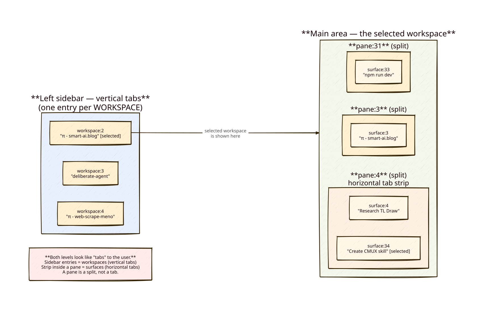
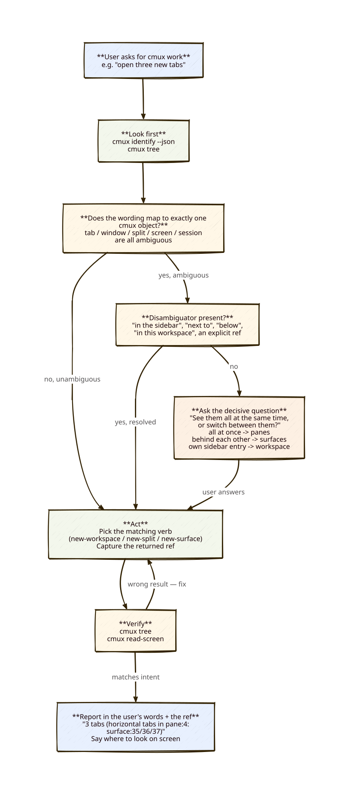
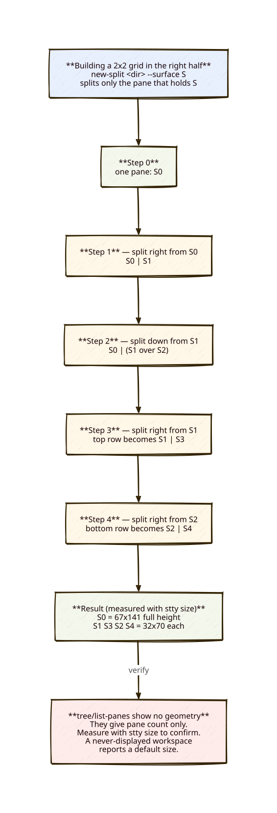

# cmux Usage

**cmux is scriptable — be an active operator, not an observer.** If you run inside cmux (`$CMUX_WORKSPACE_ID` is set), you can create splits and tabs, tile a grid, start processes in them, read their screens, and drive other agents. Do it instead of asking the user to.

> Verified against **cmux 0.64.20**, 2026-07-27. Run `cmux version` first — if it is meaningfully
> ahead, the concepts below still hold but flags and output strings may have moved; see [NOTES.md](./NOTES.md).

Three rules dominate everything below:

1. **Never guess what the user's "tab" means.** In cmux the word is genuinely ambiguous — ask.
2. **"Visible at the same time" means panes, never tabs.** This one test resolves most confusion (§3).
3. **Never assume a `send` worked.** Read the screen back.

## Diagrams







## 1. What the user actually sees

```
┌────────────────────┬──────────────────────────────────────────────────┐
│ SIDEBAR            │  [ surface:4 ][ surface:34 ]  ← horizontal tabs  │
│ (vertical tabs)    │ ┌───────────────────┬──────────────────────────┐ │
│                    │ │                   │                          │ │
│ ▸ π - smart-ai.blog│ │   pane:3          │   pane:4                 │ │
│   deliberate-agent │ │   (a split)       │   (a split, 2 tabs)      │ │
│   π - web-scrape   │ │                   │                          │ │
│   sparkz           │ ├───────────────────┴──────────────────────────┤ │
│                    │ │   pane:31  (a split)                         │ │
│ one entry =        │ └──────────────────────────────────────────────┘ │
│ one WORKSPACE      │            the selected workspace                │
└────────────────────┴──────────────────────────────────────────────────┘
```

- The **sidebar entries are workspaces**, rendered as *vertical tabs*. cmux markets itself as "a terminal with vertical tabs" — so the sidebar is what many people call "tabs".
- Inside a workspace, the area is divided into **panes** (splits/tiles). **All panes of the selected workspace are visible simultaneously.**
- Each pane has its own **horizontal tab strip**; each of those tabs is a **surface**. **Only one surface per pane is visible; the rest are hidden behind it.**
- Only the selected workspace's contents are visible. Tabs of other workspaces cannot be seen without switching — so when you create something in a background workspace, the user sees nothing until you tell them where to look.

## 2. Terminology map

| cmux CLI | Ref form | What the user sees | Words the user is likely to use |
|---|---|---|---|
| **window** | `window:2` | a separate macOS window | "window", "the other window" |
| **workspace** | `workspace:2` | an entry in the left sidebar | "**tab**", workspace, project, session, "the thing in the sidebar" |
| **pane** | `pane:4` | a split/tile — visible next to its siblings | "pane", "split", "**tile**", "**window**", box, "the right area", "**tab**" |
| **surface** = **tab** | `surface:34` / `tab:34` | a horizontal tab atop a pane — hidden behind its siblings | "**tab**", "surface" |

**`tab` and `surface` are the same object.** Verified: `cmux identify` reports `tab_id` and `surface_id` as the identical UUID, and the numbers match (`tab:34` ↔ `surface:34`). They are two names for one thing — but the commands are *not* interchangeable (see §7).

### Why "tab" is a trap

cmux has tabs at two levels and the community itself disagrees on the hierarchy: workspaces are drawn as *vertical* tabs in the sidebar, surfaces as *horizontal* tabs inside a pane. A request like *"create three new tabs in the workspace I'm in"* has at least three valid readings:

- three **surfaces** (horizontal tabs) inside the current pane → `cmux new-surface`
- three **workspaces** (sidebar entries) → `cmux new-workspace`
- three **panes** side by side, all visible at once → `cmux new-split`

Getting this wrong is the single most common failure in real sessions. Guessing wrong and creating sidebar entries when the user asked for in-pane tabs has burned entire sessions.

**Resolve compound phrasings word by word.** "Tiles within a tab" contains *two* ambiguous words: "tab" is almost certainly the *workspace*, and "tiles" are *panes*. So it means: several panes inside one workspace. Do not resolve one word and assume the other.

## 3. The decisive question

Most ambiguity collapses under a single test — ask it, or infer it from what the user already said:

> **Do you want to see them all at the same time, or switch between them?**

| Answer / phrasing | Object | Command |
|---|---|---|
| "all visible at once", "side by side", "2x2", "next to each other", "tiles", "not hidden behind one another" | **pane** | `new-split` |
| "switch between", "behind each other", "one at a time", "in the tab strip" | **surface** (tab) | `new-surface` |
| "separate project/context", "in the sidebar", "own entry" | **workspace** | `new-workspace` |

Users often say "tabs" while describing pane behaviour — *"four tabs, but they are all visible in a 2x2"*. **The visibility requirement wins over the noun.** Build panes, then mirror their word back: *"the four tiles"*.

## 4. Clarification protocol

**Trigger — ask before acting** when the request contains `tab`, `window`, `split`, `screen`, `session`, `tile`, `next to`, `beside`, `below`, `on the right`, and the sentence does not already pin down the object.

**Do not ask** when the user supplied a disambiguator: an explicit ref (`pane:4`, `workspace:2`), "in the sidebar", "in this pane", "as a split", "all visible at once", a geometry like "2x2", or when they previously fixed the meaning in this conversation.

**Ask like this** — one short question, concrete options, each described by *where it appears on screen*:

> You said "three new tabs". In cmux that can mean three things — which one?
> 1. **Tiles, all visible at once** — the area gets divided into splits (panes).
> 2. **Horizontal tabs inside your current pane** (`pane:4`) — they stack in the tab strip; one visible at a time.
> 3. **New sidebar entries** (workspaces) — new rows in the left sidebar.

Then **act**, and report back in *the user's words, bound to a ref*:

> Created the 4 tiles (panes in the right half: `surface:47`, `surface:49`, `surface:48`, `surface:50`) — top-left, top-right, bottom-left, bottom-right.

Keep speaking the user's vocabulary afterwards; carry the precise ref in parentheses. Do not re-educate them on cmux nomenclature unless they ask.

**Point at things visually** rather than describing coordinates:

```bash
cmux trigger-flash --surface surface:47
cmux notify --title "build done" --surface surface:47
```

## 5. Tiling: several things visible at once

Panes nest as a **binary split tree**: `new-split <dir> --surface S` splits *the pane that currently holds S*, and only that pane. Repeatedly splitting the right-hand pane therefore subdivides the right half without touching the left.

### Verified recipe — full-height left pane + 2×2 grid on the right

Starting from a workspace with one pane holding `$S0`:

```bash
W=workspace:21
S1=$(cmux new-split right --workspace $W --surface $S0 --focus false | awk '{print $2}')  # right half
S2=$(cmux new-split down  --workspace $W --surface $S1 --focus false | awk '{print $2}')  # right half -> top/bottom
S3=$(cmux new-split right --workspace $W --surface $S1 --focus false | awk '{print $2}')  # top row -> 2 cells
S4=$(cmux new-split right --workspace $W --surface $S2 --focus false | awk '{print $2}')  # bottom row -> 2 cells
```

```
┌──────────────────┬─────────────┬─────────────┐
│                  │  S1         │  S3         │
│  S0              ├─────────────┼─────────────┤
│  (full height)   │  S2         │  S4         │
└──────────────────┴─────────────┴─────────────┘
```

Measured with `stty size` in each pane: `S0` = 67×141 (full height, half width); `S1`,`S3`,`S2`,`S4` = 32×70 each. A real 2×2 in the right half.

**The order matters.** Split the *container* first (right, then down), then split each row. Splitting in a different order yields a different tree.

### Declarative alternative — build the whole layout at creation

`new-workspace --layout` takes a recursive split tree. `"horizontal"` means **side by side**, `"vertical"` means **stacked**. Use this when creating a fresh workspace; it is one call and cannot drift.

```bash
cmux new-workspace --name "Grid" --focus false --layout '{
  "direction":"horizontal","split":0.4,"children":[
    {"pane":{"surfaces":[{"type":"terminal","command":"echo main"}]}},
    {"direction":"vertical","split":0.5,"children":[
      {"direction":"horizontal","split":0.5,"children":[
        {"pane":{"surfaces":[{"type":"terminal","command":"echo top-left"}]}},
        {"pane":{"surfaces":[{"type":"terminal","command":"echo top-right"}]}}]},
      {"direction":"horizontal","split":0.5,"children":[
        {"pane":{"surfaces":[{"type":"terminal","command":"echo bottom-left"}]}},
        {"pane":{"surfaces":[{"type":"terminal","command":"echo bottom-right"}]}}]}]}]}'
```

`split` is the fraction given to the first child. Layout surfaces define their own `command`.

The layout schema is not in the upstream CLI contract — the keys above are the ones confirmed working. Before relying on anything beyond this shape (deeper nesting, `browser` surfaces in a layout, other pane keys), build it in a throwaway workspace and measure first.

### Two gotchas when tiling

- **`tree` and `list-panes` print panes flat, with no geometry.** They tell you *how many* panes exist, never how they are arranged. To confirm an arrangement, measure: `cmux send --surface S 'echo GEO $(stty size)\n'` then `read-screen`.
- **A workspace that has never been displayed is not laid out.** Every pane in it reports a default size (observed 29×88) regardless of the real split tree. Sizes become real once the workspace has been selected at least once, and persist afterwards. So: do not trust geometry measured in a background workspace, and be aware that TUI programs launched there may size themselves to the default until the user first opens it.

## 6. Where am I

```bash
cmux identify --json                    # authoritative: caller + focused context
cmux --json --id-format both identify   # same, with UUIDs
cmux tree                               # this window's topology
cmux tree --all                         # every window
cmux --json tree                        # structured, incl. per-pane surface lists
```

`identify` returns two different contexts — **do not conflate them**:

- `caller` — the surface **you** are running in.
- `focused` — the surface the **user** is currently looking at.

They differ whenever the user has clicked elsewhere. Use `caller` to reason about "my own terminal"; use `focused` to reason about "what the user is watching".

**Environment variables:**

| Variable | Trust |
|---|---|
| `CMUX_WORKSPACE_ID` | reliable — default `--workspace` for most commands |
| `CMUX_SURFACE_ID` | reliable — default `--surface` |
| `CMUX_TAB_ID` | **do not trust** — observed holding the *workspace* UUID, not the tab's. Pass `--tab` explicitly. |

If `$CMUX_WORKSPACE_ID` is unset you are not inside cmux; fall back to plain terminal behavior.

## 7. Creating things — pick the verb that matches the intent

| User wants | Command |
|---|---|
| new sidebar entry (workspace) | `cmux new-workspace --name "x" --cwd <path>` |
| new sidebar entry running SSH | `cmux ssh <host> --name "x" --no-focus` |
| new tile visible next to the current one | `cmux new-split <left\|right\|up\|down> --surface <ref>` |
| a grid / several tiles at once | §5 |
| new horizontal tab in a pane | `cmux new-surface --type terminal --pane <ref>` |
| new tab right of the current one | `cmux tab-action --action new-terminal-right --tab <ref>` |
| new macOS window | `cmux new-window` |
| browser tile next to a terminal | `cmux new-surface --type browser --pane <ref> --url <url>` |

**Capture the new ref — do not re-derive it.** These commands print a status line, not a bare ref:

```
OK surface:33 pane:3 workspace:2
```

```bash
S=$(cmux new-surface --type terminal --focus false | awk '{print $2}')   # -> surface:33
cmux send --surface "$S" 'npm run dev\n'
```

Piping the raw line into `--surface` fails with `Invalid surface handle: OK surface:33 pane:3 workspace:2`.

**Default to `--focus false`.** Creating things must not yank the user out of what they are doing. Focus only when the user asked to be taken there.

## 8. Targeting rules (the ref trap)

| Command family | Accepts | Rejects |
|---|---|---|
| `send`, `send-key`, `read-screen`, `close-surface`, `move-surface` | `--surface surface:N` or UUID | `--pane`, `tab:N`, bare `14` |
| `tab-action`, `rename-tab` | `--tab tab:N` **or** `--tab surface:N` | — |
| `new-split` | `--surface` / `--panel` | — |
| `list-pane-surfaces` | `--pane pane:N` | — |

Concretely:

- `read-screen` has **no** `--pane` flag → `Error: read-screen: unexpected arguments: --pane 13`. Resolve pane → surface with `cmux list-pane-surfaces --pane pane:13` first.
- `--surface tab:35` → `Error: Invalid surface handle: tab:35`. Same number, wrong prefix. Use `surface:35`.
- `--surface 14` → `Error: Surface index not found`. Bare numbers are indexes, not refs. Use `surface:14`.
- `new-workspace` has no `--no-focus`; it takes `--focus <true|false>`. `cmux ssh` *does* have `--no-focus`. Flags are not uniform — run `cmux <cmd> --help` when unsure.

## 9. Running commands in a tile

`cmux send` **types text; it does not press Enter.**

```bash
# Preferred — one atomic call, \n is a documented escape for Enter
cmux send --surface surface:35 'npm run dev\n'

# Alternative — needed for TUI apps where typing and submitting are separate steps
cmux send --surface surface:35 'ssh sparky'
cmux send-key --surface surface:35 Enter
```

Sending twice without an Enter in between concatenates on one line (`ssh sparkyssh sparky` → `Could not resolve hostname sparkyssh`). **One command per call, then verify.**

### Sending to a Pi agent surface: one physical line only

`cmux send` types into the target terminal. In a Pi agent TUI, **each embedded newline is delivered as a separate queued `Steering:` message**. A multi-line report, table, paragraph, or code block therefore becomes many disruptive steering injections, not one message.

- Send exactly **one physical line** to a Pi agent surface, followed by the final `\n` that submits it.
- Put detailed reports in an approved file at an absolute path. Notify the agent with one line only:

  ```bash
  cmux send --surface "$SUPERVISOR_SURFACE_ID" \
    'CMUX WORK REPORT — <one-sentence headline>. Full report: <absolute-path>\n'
  ```

- Do not split a report into evidence rows, commands, measurements, or task checkoffs through CMUX steering.
- When the recipient surface is known, use its exact `surface:` reference or UUID. Do not guess from a pane number or retry the same report through alternate panes/panels.
- Read the intended surface after sending before claiming delivery. A message visible on the sender's own surface is not delivery.

**Key names** (`send-key`): `enter` / `Enter` / `ENTER`, `ctrl+c`, `ctrl+u`, `Tab`, `Escape`. tmux-style names are rejected — `C-c` → `Error: invalid_params: Unknown key`.

**Recover a garbled prompt** before retyping:

```bash
cmux send-key --surface surface:35 ctrl+u   # kill the line
cmux send --surface surface:35 'the correct command\n'
```

## 10. Read before you conclude

```bash
cmux read-screen --surface surface:35 --lines 40
cmux read-screen --surface surface:35 --scrollback --lines 300
```

- Read **enough lines**. The bottom 3 lines are usually a status bar, not the state. A pi/claude status bar renders even while the agent is mid-turn — it is not evidence of "idle".
- A process is done only when the screen shows a completed summary, table, or explicit completion. "Working…" means keep waiting.
- Poll with `sleep N && cmux read-screen …`; long-running work needs tens of seconds, not one second.
- `read-screen` returns the rendered terminal, so TUI redraws and wrapped lines appear as the user sees them, not as clean logs.
- Narrow tiles wrap lines hard. In a 2×2 the panes are half-width — expect wrapped output and grep accordingly.

## 11. Golden rule: work *in* the panes

When a pane holds a session (an SSH login, a running agent, a REPL), that pane **is** the session.

- Interact through `send` / `send-key` / `read-screen`.
- Do **not** shortcut with `ssh host "command"` from your own shell — that is a different connection without the pane's environment, cwd, and state, and the user cannot see it happen.
- The visible pane is also the user's window into what you are doing. Bypassing it makes your work invisible.

## 12. Driving other agents in panes

- Establish one explicit return route in the work brief: an exact supervisor `surface:` reference or UUID, never a guessed pane/panel.
- One clear instruction per message, with absolute file paths.
- Treat CMUX as a one-line notification channel for Pi agents, not a chat transport (§9). The worker writes the full report to an approved absolute path and sends one `CMUX WORK REPORT — … Full report: …` line.
- Wait for the worker's complete report before replying. Send at most one consolidated acceptance, rejection, or correction message; never steer clause-by-clause while it is working or reporting.
- A correction is one bounded slice followed by one new complete report, not a sequence of evidence-row steering messages.
- Track each pane's state independently when several run in parallel.
- Ask for cross-checks only after the agent reported completion.

## 13. Non-disruptive automation

- `--focus false` by default; never steal focus mid-task.
- Never close or repurpose a surface the user is working in.
- Prefer `trigger-flash` / `notify` over focus changes to draw attention.
- Build experiments in a throwaway workspace (`--focus false`), then `cmux close-workspace --workspace <ref>` when done — never prototype layouts in the user's live workspace.
- Before editing `~/.config/cmux/cmux.json`, back it up to a timestamped `.bak`; apply with `cmux reload-config` (reloads cmux.json **and** `~/.config/ghostty/config`, no restart).
- Terminal appearance (font, theme, opacity, blur, scrollback) belongs in Ghostty config, not cmux settings.

## 14. Verified failure catalogue

| Symptom | Cause | Fix |
|---|---|---|
| `read-screen: unexpected arguments: --pane N` | `read-screen` is surface-only | `list-pane-surfaces --pane pane:N`, then `--surface` |
| `Invalid surface handle: tab:35` | `tab:` prefix on a surface flag | use `surface:35` |
| `Surface index not found` | bare number passed as ref | use `surface:14` |
| `Invalid surface handle: OK surface:33 pane:3 workspace:2` | captured the whole status line | `\| awk '{print $2}'` |
| `invalid_params: Unknown key` | tmux key name (`C-c`) | `ctrl+c` |
| command typed but never runs | `send` does not press Enter | append `\n` or follow with `send-key Enter` |
| `ssh hostssh host` on the prompt | two `send`s without Enter | `send-key ctrl+u`, resend once |
| `unknown flag '--no-focus'` | flag exists on `cmux ssh`, not `new-workspace` | `--focus false` |
| every pane reports the same odd size (e.g. 29×88) | workspace never displayed, so not laid out | select it once, or don't trust background geometry |
| grid came out wrong | split order, or trusting flat `tree` output as geometry | §5 — split container first, then rows; measure with `stty size` |
| created a sidebar entry, user wanted tiles | "tab" not clarified | §3, §4 |

## 15. Discovery

```bash
cmux --help
cmux <command> --help
cmux docs [settings|shortcuts|api|browser|agents|dock|sidebars]
curl -fsSL https://raw.githubusercontent.com/manaflow-ai/cmux/main/docs/cli-contract.md
curl -fsSL https://raw.githubusercontent.com/manaflow-ai/cmux/main/skills/cmux/SKILL.md
```

cmux ships browser automation on the same socket (`cmux browser open|goto|snapshot|click|eval|screenshot …`) — a real browser pane next to the terminal. Use `cmux docs browser` when a task needs it.

**[NOTES.md](./NOTES.md)** — provenance, verified-against version, how each claim was established, and known unmapped edges. Read it when a claim here does not match reality, or before extending the skill.
